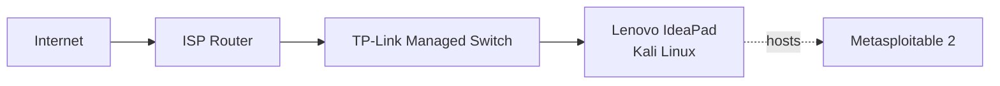

# KyaniteCyberLab 🪨 → 🚧 In Progress

A dedicated defensive cybersecurity lab used for network analysis, threat detection, vulnerability assessment, malware analysis, and digital forensics & incident response (DFIR) exercises. 

The goal of this lab is to build practical cybersecurity skills using open-source tools and budget-friendly hardware. It also serves as a hands-on learning environment to reinforce concepts and develop the experience I need to prepare for the CompTIA CySA+ exam. 

KyaniteCyberLab is named after the blue mineral kyanite, reflecting the defensive blue team side of cybersecurity. Formed under immense geological pressure, kyanite symbolizes resilience, stability, and growth through challenging environments. 

---

## 🔵 Objectives 

&ensp;❖ Build a cybersecurity testing environment.  
&ensp;❖ Practice network monitoring and traffic analysis.  
&ensp;❖ Develop vulnerability assessment skills.  
&ensp;❖ Conduct malware and forensic investigations.  
&ensp;❖ Document security projects and findings.  

---

## 🖿 Planned Projects & Exercises 

&ensp;☐ Snort IDS Deployment  
&ensp;☐ Network Traffic Analysis with Wireshark  
&ensp;☐ Metasploitable 2 Enumeration  
&ensp;☐ Threat Detection  
&ensp;☐ Digital Forensics Investigations  
&ensp;☐ Legacy Network Security Hardware Research (Fortinet FortiGate 60D Firewall)  

---
## 🌐︎ Lab Infrastructure  

| **Item** | **Specifications** | 
| --- | --- | 
| **Host Machine** | Secondhand Lenovo IdeaPad Y700 w/ 32GB RAM |
| **Operating System** | Kali Linux | 
| **Virtualization** | VirtualBox, VMware Workstation | 
| **Virtual Machines** | Kali Linux, Metasploitable 2 | 
| **Network Design** | TP-Link Managed Switch used to isolate lab devices from home systems |

---

## 🖧 Lab Topology 

---

## 🛠 Tools & Technologies 

### Security Tools

In Progress...

---

## 🗐 Project Documentation 

